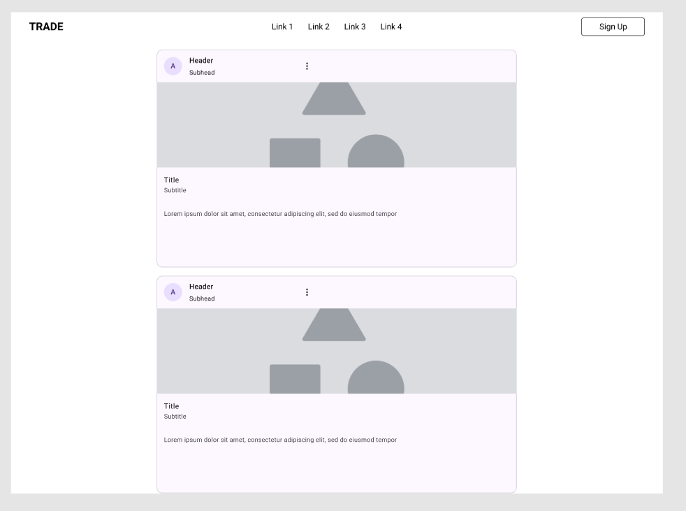
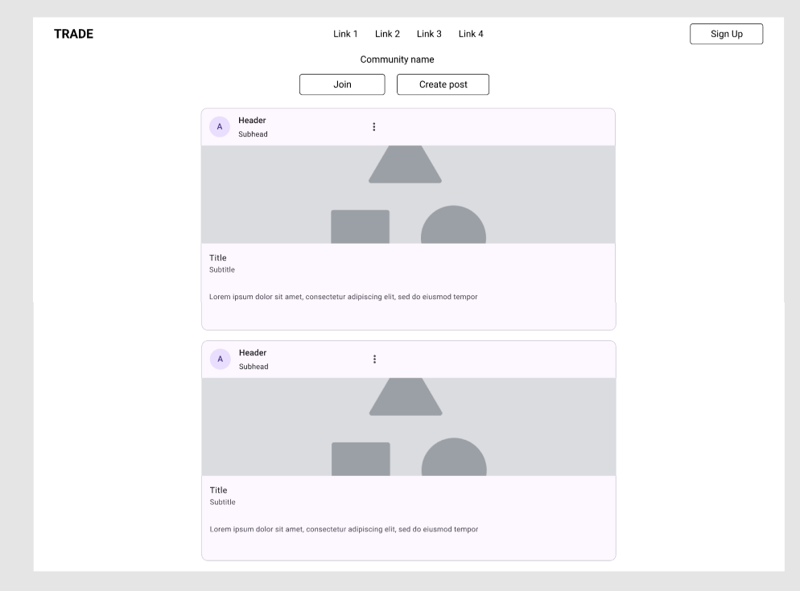
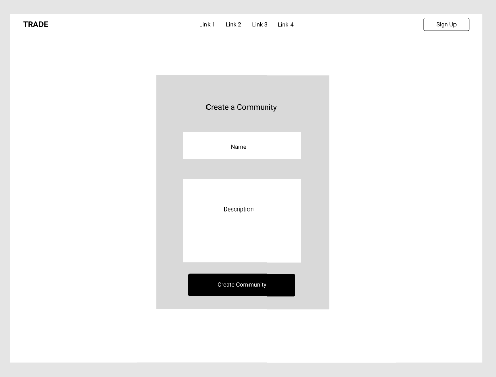
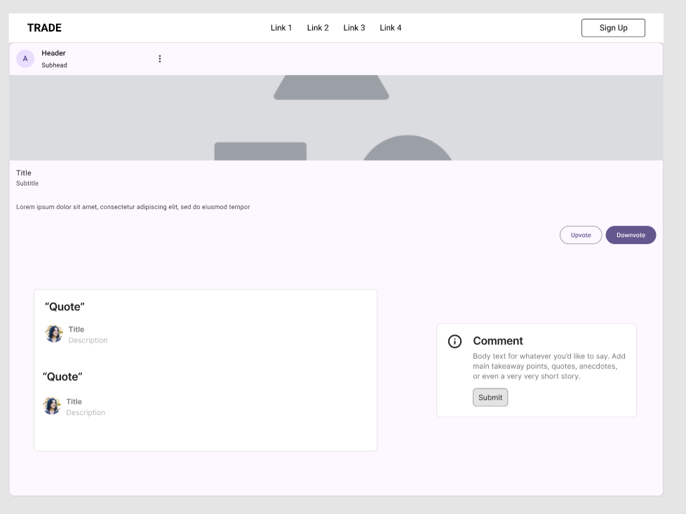
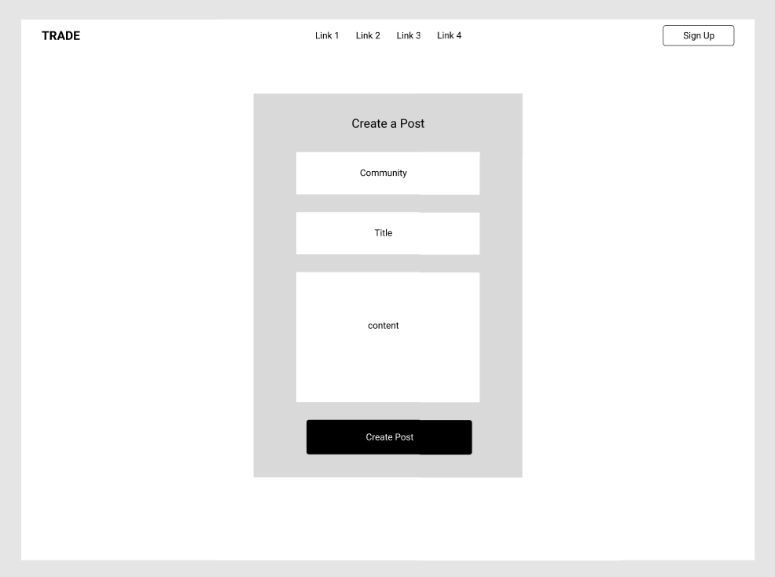
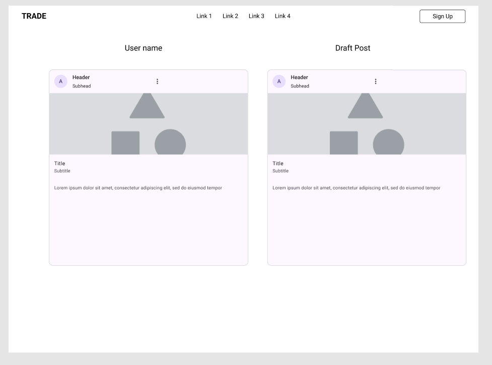
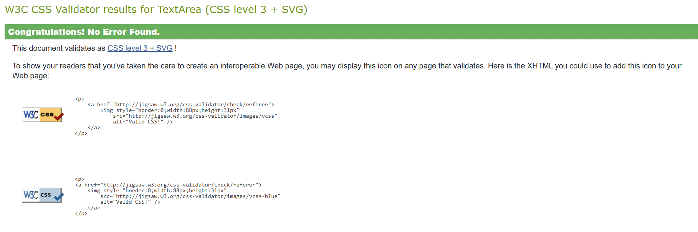
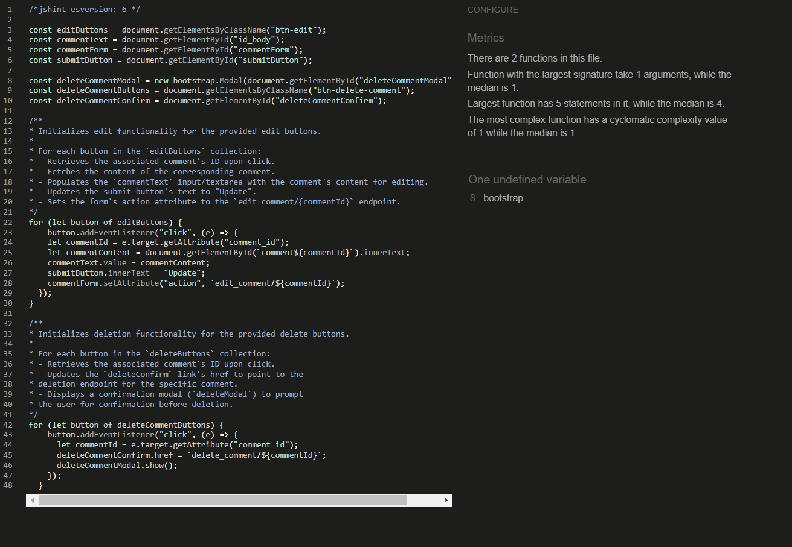

# Transmit

## Overview

Welcome to Transmit, your go-to platform for community-driven content and discussions! Inspired by the popular Reddit model, Transmit brings together users from all walks of life to share, discuss, and vote on topics that matter most to them.

---

## Design

### Colour Scheme

Transmit colour palette
- Primary colors: **#004aad**, **#f15226**, **#ff7043** and **#264bf1**.
- Most pages have a white background to ensure readability.
- Text uses the browser's default color for simplicity and accessibility.
- The color scheme remains consistent across all pages.

### Typography
- The app uses **Roboto** font-family for all text, ensuring compatibility and simplicity.
- Backup Font is **san-serif**.

---

## Features

### General Features
All the pages on the website have :

- **Favicon**: A recognizable icon that represents the app.
- **Navbar**: A responsive navigation bar that collapses into a burger menu on mobile and tablet devices for easy access.
- **Footer**: Contains links to the app’s social media accounts.

---

## Wireframes

### 1. Homepage wireframe
A page where users can browse through all posts, view brief descriptions, and click to explore detailed content within a specific community.

### 2. Community detail wage wireframe
A community page where users can join, create posts, and browse existing posts.

### 3. Create community page wireframe
A page where user can create commuity.

### 4. Post detail page wireframe
A post detail page where users can view, vote, comment, and manage their posts.

### 5. Create/Edit post page wireframe
A page where user can create and edit the post.

### 6. Profie page wireframe
A user profile page displaying their posts, and drafts.

---

#### Home(index) Page

The Home Page is card like sections which will show community name post title and content:
- community name should redirect to community detail page
- post title should redirect to post detail page

The Home page provides information about all the post that has been done by all community.

#### Community detail page

---
The Community detail page shows the overview of all the post that has been created within the community
- it has button to join the community
- it has button to create a new post
- It has user name which will redirect to the user profile
- it also has post tile which will redirect user to post detail along side post content

#### Post detail page

---
The Post detail page shows the post user has click in full details with the option of voting and commenting
- it has button to edit/delete the post
- it has user name which will redirect to user profile page
- it has button to upvote/downvote the post
- it has a form to comment on the post
- it has button to edit/delete the comment

#### User profile page
The User profile page shows the post user has made withing any community
- it has user name
- it has community name which will redirect to community detail page
- it has post title which will redirect to post detail page
- it also have draft post which only current user can see

#### Future Features

---

- Draft post will be better render easier to find
- when creating post from the community the community name will be automatically filled
- better UI will be added so user have better understanding about the page
- user will be able to add images, videos, banner and more
- comment will be better so user can comment on other user comment aswell
- community description rules and policy will be added for user to have safe environment#
- community will be able to pick tags and from that their will be a search bar
- logo will be added

---

## Transmit - TESTING DOCUMENTATION

---

## AUTOMATED TESTING

### Django automated testing

- test_forms.py for forms automated testing have been done
- test_views.py for views automated testing have been done

## Manual Testing 

### User Story Test

1. **Account registration**

- **AC1**: Given an email, a user can register an account.
  - **Status**: ✅ Passed
  - **Details**: The registration process works as expected:
    - The user can enter a valid email, username, and password to register successfully.
    - Input validations prevent registration with invalid or missing data.
    - Once registered user will be redirected to the home page.
    - Email address is optional.

- **AC2**: Then the user can log in.
  - **Status**: ✅ Passed
  - **Details**: The login functionality works as expected:
    - Users can log in with valid credentials (username and password).
    - Incorrect credentials show an appropriate error message.
    - Logged-in users are redirected to the home page after successful login.

- **AC3**: When the user is logged in, they can create a community, post, and comment.  
  - **Status**: ✅ Passed  
  - **Details**:  
    - Logged-in users can create communities with valid names and descriptions.  
    - Users can create posts under a community and submit them successfully.  
    - Users can comment on posts, and their comments appear under the respective post.  
    - Error messages are displayed if inputs are invalid for any of the actions. 

2. **Homepage testing**

- **AC1**: Page Header
   - **Scenario**: The header displays correctly.
   - **Steps**:
   1. Navigate to the "Explore Communities" page.
   2. Check that the title `Explore Communities` and the description `Discover and join discussions that interest you!` appear.
   - **Expected Result**: The header text is displayed prominently and styled correctly.

- **AC2**: Community Post List
   - **Scenario**: Posts are loaded and displayed in a list.
   - **Steps**:
   1. Ensure that the page loads without errors.
   2. Verify that each post is displayed with the following details:
      - Community name.
      - Post title.
      - Post content preview.
      - Post author.
   3. Ensure that the cards are styled and properly aligned.
   - **Expected Result**: All posts load correctly, and each contains the required information.

- **AC3**: Community Links
   - **Scenario**: Community links redirect to the correct community detail page.
   - **Steps**:
   1. Click on the community name in the post card.
   2. Verify that it navigates to the corresponding community detail page.
   - **Expected Result**: The link redirects to the correct URL for the selected community.

- **AC4**: Post Links
   - **Scenario**: Post links redirect to the correct post detail page.
   - **Steps**:
   1. Click on the post title or "Read More" button.
   2. Verify that it navigates to the correct post detail page.
   - **Expected Result**: The link redirects to the correct URL for the selected post.

- **AC5**: User Profile Links
   - **Scenario**: User profile links redirect to the correct user profile page.
   - **Steps**:
   1. Click on the author's name in the post card footer.
   2. Verify that it navigates to the corresponding user's profile page.
   - **Expected Result**: The link redirects to the correct user profile URL.

### Test Results
- **Header**: ✅ Passed.
- **Post List**: ✅ Passed.
- **Community Links**: ✅ Passed.
- **Post Links**: ✅ Passed.
- **User Profile Links**: ✅ Passed.

### Notes
- All links have been verified to point to the correct URLs.
- No broken links or styling issues were encountered during testing.

3. **Comunity detail page Testing**

- **AC1**: The header displays correctly.
   - **Scenario**: The community name is displayed prominently at the top of the page.
   - **Steps**:
   1. Navigate to the "Community Detail" page for any community.
   2. Check that the community name appears as a title in bold text.
   3. Ensure that the join/joined button is visible for logged-in users and styled correctly.
   4. If not logged in, confirm the message prompting users to log in is displayed.
   - **Expected Result**: 
   - The community name is displayed at the center of the header.
   - The join/joined button or login message is displayed based on the user’s authentication status.

- **AC2**: The join/leave functionality works.
   - **Scenario**: Logged-in users can join or leave a community using the button.
   - **Steps**:
   1. Log in as a user.
   2. Navigate to a community detail page.
   3. Click the "Join" button if the user is not a member, or the "Joined" button if the user is a member.
   4. Verify that the page updates and reflects the correct membership status.
   - **Expected Result**: 
   - Clicking "Join" adds the user to the community.
   - Clicking "Joined" removes the user from the community.

- **AC3**: Logged-in users can create posts.
   - **Scenario**: A button to create posts is visible and functional for logged-in users.
   - **Steps**:
   1. Log in as a user.
   2. Navigate to a community detail page.
   3. Click the "Create a Post" button.
   4. Verify that the user is redirected to the "Create Post" page.
   - **Expected Result**: The "Create a Post" button redirects to the post creation form.

- **AC4**: Posts in the community are displayed in a list.
   - **Scenario**: Posts associated with the community are displayed.
   - **Steps**:
   1. Navigate to a community detail page.
   2. Verify that each post displays the following information:
      - Post author and the time it was created.
      - Post title.
      - Post content preview.
   3. Ensure that posts are aligned properly and styled consistently.
   - **Expected Result**: Posts are listed correctly, displaying all the required information.

- **AC5**: Post links redirect to the correct post detail page.
   - **Scenario**: Clicking on a post title or "Read More" button navigates to the post detail page.
   - **Steps**:
   1. Navigate to the "Community Detail" page.
   2. Click on a post title or "Read More" button.
   3. Verify that the correct post detail page is displayed.
   - **Expected Result**: The post link redirects to the correct post detail page.

- **AC6**: A message is displayed if there are no posts in the community.
   - **Scenario**: The community has no posts.
   - **Steps**:
   1. Navigate to the "Community Detail" page for a community with no posts.
   2. Verify that a message stating "No posts in this community yet." is displayed.
   - **Expected Result**: The message is visible and styled appropriately.

### Test Results
- **Page Header**: ✅ Passed
- **Join/Leave Community Button**: ✅ Passed
- **Create a Post Button**: ✅ Passed
- **Post List**: ✅ Passed
- **Post Links**: ✅ Passed
- **No Posts Message**: ✅ Passed

### Notes
- All features were tested manually, and no issues were encountered.
- Styling and links were verified to work across browsers and screen sizes.

4. **Post detail page Testing**

- **AC1**: The header displays correctly.
   - **Scenario**: The post title, author, and creation date are displayed prominently at the top of the page.
   - **Steps**:
   1. Navigate to the "Post Detail" page for any post.
   2. Check that the post title appears in a large, bold font.
   3. Verify that the post author’s name is clickable and leads to the user’s profile page.
   4. Ensure the creation date of the post is displayed correctly.
   - **Expected Result**:
   - The post title is displayed at the top of the page.
   - The post author’s name is clickable and redirects to their profile.
   - The creation date is displayed correctly.

- **AC2**: Logged-in users can edit or delete their own posts.
   - **Scenario**: The "Edit" and "Delete" buttons appear for the post author.
   - **Steps**:
   1. Log in as the author of a post.
   2. Navigate to the "Post Detail" page.
   3. Check that the "Edit" and "Delete" buttons are visible and functional.
   4. Click "Edit" to ensure it redirects to the edit page.
   5. Click "Delete" to ensure a confirmation modal appears.
   6. Confirm the deletion to ensure the post is removed.
   - **Expected Result**:
   - The "Edit" button redirects to the edit page.
   - The "Delete" button shows a confirmation modal and successfully deletes the post upon confirmation.

- **AC3**: Users can vote on posts.
   - **Scenario**: Users can upvote or downvote a post.
   - **Steps**:
   1. Navigate to the "Post Detail" page.
   2. Ensure that both the upvote and downvote buttons are displayed.
   3. Click the upvote button to increase the vote count.
   4. Click the downvote button to decrease the vote count.
   5. Verify the total vote count updates correctly after each action.
   - **Expected Result**:
   - Clicking the upvote button increases the vote count.
   - Clicking the downvote button decreases the vote count.
   - The vote count updates correctly.

- **AC4**: Users can add, edit, or delete comments.
   - **Scenario**: Logged-in users can add, edit, and delete their own comments.
   - **Steps**:
   1. Log in as a user.
   2. Navigate to the "Post Detail" page.
   3. Ensure that a comment section is displayed.
   4. Add a new comment and submit it.
   5. Check that the comment appears in the comment section.
   6. Click "Edit" next to your comment to modify it and ensure the changes are saved.
   7. Click "Delete" next to your comment to ensure the comment is deleted after confirmation.
   - **Expected Result**:
   - The comment appears in the comment section after submission.
   - The "Edit" button allows modifications to the comment.
   - The "Delete" button removes the comment after confirmation.

- **AC5**: A message is displayed if there are no comments.
   - **Scenario**: The post has no comments.
   - **Steps**:
   1. Navigate to the "Post Detail" page for a post with no comments.
   2. Verify that the message "No comments yet. Be the first to comment!" is displayed.
   - **Expected Result**:
   - The message "No comments yet. Be the first to comment!" is displayed when there are no comments.

- **AC6**: The "About the Post" section displays the community name correctly.
   - **Scenario**: The community name associated with the post is displayed correctly.
   - **Steps**:
   1. Navigate to the "Post Detail" page.
   2. Check the "About the Post" section.
   3. Ensure the community name is displayed and is a clickable link leading to the community detail page.
   - **Expected Result**:
   - The community name is displayed and is clickable, redirecting to the community detail page.

### Test Results
- **Page Header**: ✅ Passed
- **Edit and Delete Post (for Author)**: ✅ Passed
- **Voting Functionality**: ✅ Passed
- **Commenting Functionality**: ✅ Passed
- **No Comments Message**: ✅ Passed
- **About the Post Section**: ✅ Passed

### Notes
- All features were tested manually, and no issues were encountered.
- Styling and links were verified to work across browsers and screen sizes.

5. **Create community page testing**

- **AC1**: The page header displays correctly.
   - **Scenario**: The header displays "Create a Community" at the top of the page.
   - **Steps**:
   1. Navigate to the "Create a Community" page.
   2. Check that the header "Create a Community" is displayed at the top of the form.
   - **Expected Result**:
   - The header "Create a Community" is clearly displayed at the top of the page.

- **AC2**: The community creation form is displayed correctly.
   - **Scenario**: The form is present and includes all necessary fields.
   - **Steps**:
   1. Navigate to the "Create a Community" page.
   2. Ensure the form contains the appropriate fields (e.g., community name, description, etc.).
   3. Check that the form elements are aligned and styled properly.
   - **Expected Result**:
   - The form should be visible with all required fields displayed and styled correctly using `crispy` forms.

- **AC4**: The form submits successfully with valid data.
   - **Scenario**: Submit the form with valid input data and ensure that the community is created.
   - **Steps**:
   1. Navigate to the "Create a Community" page.
   2. Enter valid data for all form fields.
   3. Click the "Create Community" button.
   4. Verify that the community is created and redirected to the community detail page or a success message is shown.
   - **Expected Result**:
   - The form submission redirects the user to the community detail page, or a success message is displayed, indicating that the community has been created successfully.

- **AC5**: The form shows appropriate error messages for invalid data.
   - **Scenario**: Submit the form with invalid or missing data and verify that appropriate error messages are displayed.
   - **Steps**:
   1. Navigate to the "Create a Community" page.
   2. Leave required fields empty or enter invalid data.
   3. Click the "Create Community" button.
   4. Verify that appropriate error messages are displayed for invalid or missing fields.
   - **Expected Result**:
   - Error messages should appear next to the respective fields, prompting the user to correct the input.

### Test Results
- **Page Header**: ✅ Passed
- **Form Display**: ✅ Passed
- **Form Submission (Valid Data)**: ✅ Passed
- **Form Submission (Invalid Data)**: ✅ Passed

### Notes
- All features were tested manually, and no issues were encountered.
- The form behaves as expected when valid and invalid data are submitted.
- Button and form elements were verified to be styled correctly and to work responsively across devices.

6. **Post Creation and Editing Testing**

#### 1. **Create a Post Page Testing**

- **AC1**: The page header displays correctly.
   - **Scenario**: The header displays "Create a Post" at the top of the page.
   - **Steps**:
   1. Navigate to the "Create a Post" page.
   2. Check that the header "Create a Post" is displayed at the top of the page.
   - **Expected Result**:
   - The header "Create a Post" is visible and centered at the top of the page.

- **AC2**: The form is displayed correctly.
   - **Scenario**: The form for creating a post is displayed with all necessary fields.
   - **Steps**:
   1. Navigate to the "Create a Post" page.
   2. Ensure the form contains fields for post title, content, and any other required information.
   3. Verify that all fields are properly styled and aligned.
   - **Expected Result**:
   - The form fields should be visible and styled correctly, with all required input fields displayed.

- **AC4**: The "Create Post" button is visible and functions correctly.
   - **Scenario**: The "Create Post" button is visible and clickable, and it submits the form.
   - **Steps**:
   1. Navigate to the "Create a Post" page.
   2. Check that the "Create Post" button is visible and properly styled.
   3. Click the "Create Post" button to submit the form.
   - **Expected Result**:
   - The button is visible and styled correctly.
   - Upon clicking, the form is submitted and redirects to a success page or the post is created.

- **AC5**: Form submission with valid data.
   - **Scenario**: Submit the form with valid data and verify the post is created.
   - **Steps**:
   1. Navigate to the "Create a Post" page.
   2. Enter valid data for the post title and content.
   3. Click the "Create Post" button to submit the form.
   4. Verify that the user is redirected to a page showing the created post or a success message.
   - **Expected Result**:
   - The post is created successfully, and the user is redirected to the post detail page or a confirmation message is shown.

- **AC6**: Form submission with invalid data.
   - **Scenario**: Submit the form with invalid or incomplete data.
   - **Steps**:
   1. Navigate to the "Create a Post" page.
   2. Leave required fields empty or enter invalid data.
   3. Click the "Create Post" button.
   4. Check for validation error messages.
   - **Expected Result**:
   - Appropriate error messages should appear next to the invalid fields, prompting the user to correct the input.

---

#### 2. **Edit Post Page Testing**

- **AC1**: The page header displays correctly.
   - **Scenario**: The header displays "Edit Post: [Post Title]" at the top of the page.
   - **Steps**:
   1. Navigate to the "Edit Post" page for a specific post.
   2. Verify that the header displays "Edit Post: [Post Title]" where the post title is correct.
   - **Expected Result**:
   - The header should correctly display the title of the post being edited, in the format "Edit Post: [Post Title]".

- **AC2**: The post content is pre-filled in the form fields.
   - **Scenario**: The post’s title and content should be pre-filled in the form fields.
   - **Steps**:
   1. Navigate to the "Edit Post" page for a specific post.
   2. Check that the title and content of the post are pre-filled in the respective form fields.
   - **Expected Result**:
   - The form fields should be pre-filled with the current title and content of the post.

- **AC4**: The "Update Post" button is visible and functions correctly.
   - **Scenario**: The "Update Post" button is visible, and clicking it submits the form with updated data.
   - **Steps**:
   1. Navigate to the "Edit Post" page.
   2. Check that the "Update Post" button is visible and styled correctly.
   3. Make changes to the post title or content, then click the "Update Post" button.
   - **Expected Result**:
   - The button should be visible and styled correctly.
   - After clicking the "Update Post" button, the form is submitted, and the post is updated.

- **AC5**: The "Cancel" button works correctly.
   - **Scenario**: The "Cancel" button navigates the user back to the profile page.
   - **Steps**:
   1. Navigate to the "Edit Post" page.
   2. Click the "Cancel" button.
   3. Verify that the user is redirected to the profile page or the previous page.
   - **Expected Result**:
   - Clicking "Cancel" redirects the user back to the appropriate page, such as the profile page.

- **AC6**: Form submission with valid data.
   - **Scenario**: Submit the form with valid data and ensure the post is updated.
   - **Steps**:
   1. Navigate to the "Edit Post" page.
   2. Make valid changes to the post title or content.
   3. Click the "Update Post" button to submit the form.
   4. Verify that the changes are reflected in the post and the user is redirected to the updated post page.
   - **Expected Result**:
   - The post is updated successfully, and the user is redirected to the post detail page where the changes are visible.

- **AC7**: Form submission with invalid data.
   - **Scenario**: Submit the form with invalid or incomplete data.
   - **Steps**:
   1. Navigate to the "Edit Post" page.
   2. Leave required fields empty or enter invalid data.
   3. Click the "Update Post" button.
   4. Check for validation error messages.
   - **Expected Result**:
   - Appropriate error messages should appear next to the invalid fields, prompting the user to correct the input.

---

### Test Results
- **Create a Post Page**: ✅ Passed
- **Edit Post Page**: ✅ Passed

### Notes
- All features were tested manually, and no issues were encountered.
- Form submission works as expected for both creating and editing posts.
- The "Create Post" and "Update Post" buttons are functional, and the "Cancel" button behaves as expected.

7. **Profile page Testing**

#### 1. **User Profile Page Testing**

- **AC1**: The username is displayed correctly.
   - **Scenario**: The username of the user is displayed prominently at the top of the profile page.
   - **Steps**:
   1. Navigate to the "User Profile" page.
   2. Check that the username is displayed in a large font at the top of the page.
   - **Expected Result**:
   - The username should be displayed as a heading at the top of the page, matching the profile user's username.

- **AC2**: User posts are displayed correctly.
   - **Scenario**: If the user has posts, they are listed below the username in the profile.
   - **Steps**:
   1. Navigate to the "User Profile" page.
   2. If the user has posts, ensure they are displayed in cards, each with the post title and content.
   3. Click on any post to ensure it navigates to the correct post detail page.
   - **Expected Result**:
   - Each post should appear in its own card, with the title linking to the post detail page.
   - The content of the post should be shown below the title.
   - The community name should also be linked correctly to the community detail page.

- **AC3**: Display when the user has no posts.
   - **Scenario**: If the user has no posts, a "No posts yet" message should be shown.
   - **Steps**:
   1. Navigate to the "User Profile" page.
   2. Check that a message "No posts yet" is displayed when the user has no posts.
   - **Expected Result**:
   - A message saying "No posts yet" should be displayed in place of post cards.

---

#### 2. **Draft Posts Section Testing**

- **AC1**: The "Draft Posts" section is displayed for authenticated users.
   - **Scenario**: The "Draft Posts" section should be visible if the user is authenticated.
   - **Steps**:
   1. Log in as an authenticated user.
   2. Navigate to the "User Profile" page.
   3. Verify that the "Draft Posts" section appears on the right side of the page.
   - **Expected Result**:
   - The "Draft Posts" section should appear if the user is authenticated, displaying a list of the user's draft posts.

- **AC2**: Draft posts are displayed correctly.
   - **Scenario**: If the user has draft posts, they are displayed in cards with titles and content.
   - **Steps**:
   1. Log in as an authenticated user with draft posts.
   2. Navigate to the "User Profile" page.
   3. Check that the draft posts appear in cards, each with the draft post title and content.
   4. Click on any draft post to ensure it navigates to the "Edit Post" page.
   - **Expected Result**:
   - Draft posts should appear in a separate section, each with a title linked to the edit page.
   - The content of the draft post should be displayed below the title.

- **AC3**: Display when the user has no draft posts.
   - **Scenario**: If the user has no draft posts, a "No drafts yet" message should be shown in the "Draft Posts" section.
   - **Steps**:
   1. Log in as an authenticated user with no draft posts.
   2. Navigate to the "User Profile" page.
   3. Verify that a message "No drafts yet" is displayed in the "Draft Posts" section.
   - **Expected Result**:
   - The "Draft Posts" section should display a message "No drafts yet" when the user has no draft posts.

- **AC4**: Draft posts can be edited.
   - **Scenario**: Clicking on a draft post takes the user to the "Edit Post" page.
   - **Steps**:
   1. Log in as an authenticated user with draft posts.
   2. Navigate to the "User Profile" page.
   3. Click on any draft post in the "Draft Posts" section.
   4. Verify that the user is taken to the "Edit Post" page where they can update the draft.
   - **Expected Result**:
   - Clicking on a draft post should redirect to the "Edit Post" page for that post, where the user can edit the draft.

---

### Test Results
- **User Profile Page**: ✅ Passed
- **Draft Posts Section**: ✅ Passed

### Notes
- All features were tested manually, and no issues were encountered.
- The username, user posts, and draft posts are displayed as expected.
- The "No posts yet" and "No drafts yet" messages are displayed correctly when applicable.
- The links for posts and draft posts redirect correctly to the respective detail or edit pages.

### W3C Validator

[W3C](https://validator.w3.org/) was used to validate all HTML pages, as well as the [CSS](https://jigsaw.w3.org/css-validator/#validate_by_uri) also [Jshint](https://jshint.com/) was used to validate JavaScript
  
- html page W3C HTML Validation - Pass
   
- style.css CSS Validation - Pass
   
- script.js JavaScript Validation - Pass
   

---

## Manual Testing

### Responsiveness

---

Each page has been inspected on variety of devices such as mobile, laptop, desktop. Moreover, they have been tested on multiple browser such as Google, Microsoft edge.

### Validation

- The header section:
  - Transmit has a clickable link to the Home page.
  - Home page has a clickable link to the Home page.
  - My profile has a clickable link to the user profile page.

- The footer section:
  - Facebook Font Awesome has a clickable link to the Facebook page.
  - Instagram Font Awesome has a clickable link to the Instagram page.
  - Twitter(X) Font Awesome has a clickable link to the Twitter(X) page.
  - Youtube Font Awesome has a clickable link to the Youtbe page

## Accessibility

---
Care has been taken throughout the coding to ensure that this website is as accessible friendly as possible. Particular attention has been given to the following points:

- Ensuring sufficient contrast between the text and its respective background.
- Using a bootstrap for the buttons for the buttons and the text input fields.

## Technologies used

#### Frameworks, Libraries & Programs Used

- [Favicon.io](https://favicon.io/) - To create and download the favicon logo.
- [Google HTML/CSS style guide](https://google.github.io/styleguide/htmlcssguide.html) - To create proper pages with rules.
- [Font awesome](https://fontawesome.com/) - for the social media and navbar burger icons.
- [W3C HTML validator](https://validator.w3.org/) - To validate all the HTML file.
- [W3C CSS validator](https://jigsaw.w3.org/css-validator/) - To validate CSS file.
- [Jshint validator](https://jshint.com/) - To validate JavaScript file. 
- [Google Dev tools](https://developer.chrome.com/docs/) - to troubleshoot and test issues during the development.
- [MDN webdocs](https://developer.mozilla.org/en-US/) - reference
- [W3C schools](https://www.w3schools.com/) - for resolving code format in CSS and HTML.
- [Bootstrap](https://getbootstrap.com/docs/5.3/getting-started/introduction/) - for design and css.

## Deployment

---
 This site was deployed using the following steps:

1. Open GitHub.
2. Select the project to be deployed.
3. Go to 'Settings'.
4. In the Code and Automation section, select Pages.
5. Set Source to 'Deploy from a branch'.
6. Select Main Branch.
7. Set Folder to 'Root'.
8. Under Branch click 'Save'
9. The link to the live website is now displayed at the top of the page.

### Local development

---

#### How to Fork

1. Log in to Github.
2. Go to the repository for this project.
3. At the top right of the page, click the "Fork" button. This will create a copy of the repository under your Github account.

#### How to clone

1. Log in to Github.
2. Go to the repository for this project.
3. Click on the "Code" button, select from HTTPS, SSH or Github CLI.
4. Copy the URL for the repository.
5. Open your terminal or command prompt.
6. Navigate to the directory where you want to clone your repository.
7. Use the `git clone` command followed by the URL that you have copied.

## Heroku Deployment Guide

### **1. Prepare Your Project**
- Make sure your Django project is pushed to a GitHub repository (use the `main` branch).
- Ensure that your `requirements.txt` file includes all necessary dependencies.

### **2. Set Up Heroku**
- **Create a Heroku Account**: [Sign up for Heroku](https://signup.heroku.com/).
- **Create a New App on Heroku**:
  1. Visit your Heroku dashboard.
  2. Click on **New** and select **Create new app**.
  3. Choose a name for your app and select a region.
  
### **3. Configure the App on Heroku**
- **Add Configuration Variables (Config Vars)**:
  1. Go to the **Settings** tab in your Heroku app's dashboard.
  2. Scroll to **Config Vars** and add the all keys that is required

### **4. Link Your GitHub Repository to Heroku**
- **Link GitHub Repo**:
  1. Go to the **Deploy** tab in the Heroku dashboard.
  2. Scroll to **Deployment method** and select **GitHub**.
  3. Sign in to your GitHub account and search for your repository.
  4. Click **Connect** to link the repository.

### **5. Deploy Your App**
- **Manual Deployment**:
  1. Scroll down to **Manual Deploy**.
  2. Select the `main` branch or your desired branch.
  3. Click **Deploy Branch** to manually deploy your app.

- Once the deployment is successful, you’ll see a **View App** button. Click it to access your live app.

### **6. Make Future Deployments**
- For future deployments:
  1. Go to the **Deploy** tab on Heroku.
  2. Scroll to **Manual Deploy**.
  3. Click **Deploy Branch** to deploy your latest changes.

